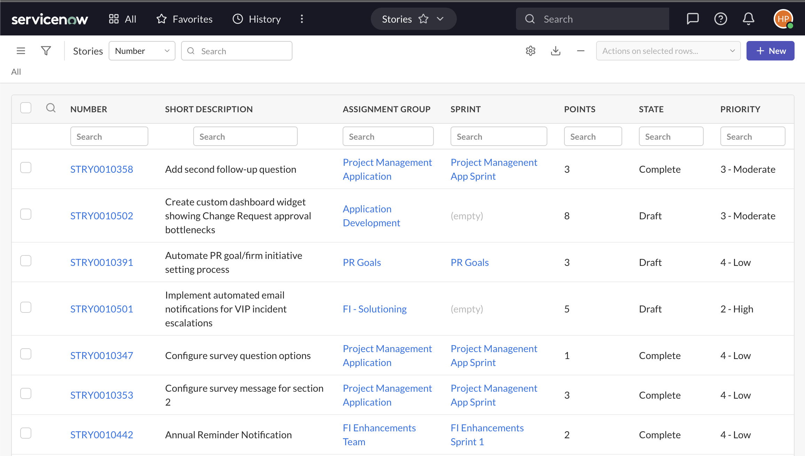
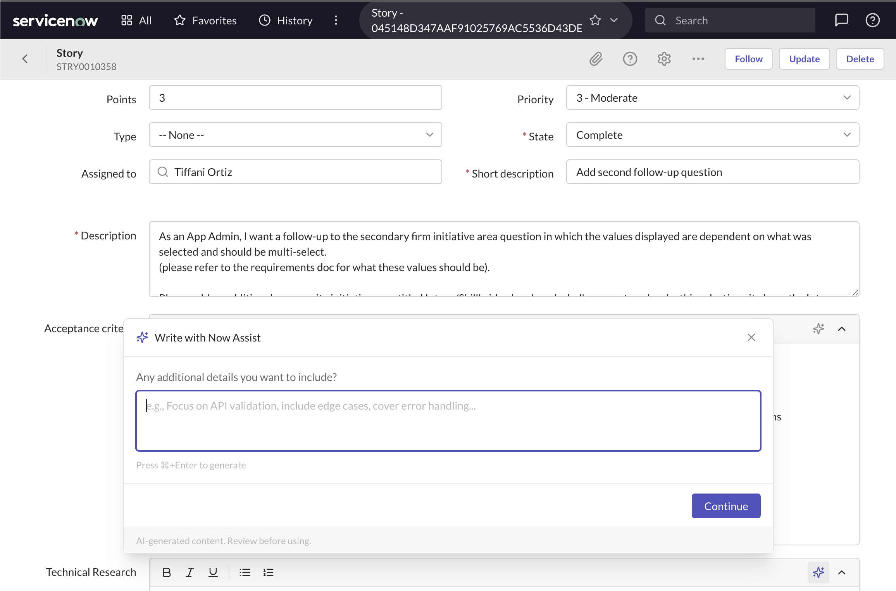

# SN Mockup

A rapid prototyping tool for ServiceNow platform UI. Build and interact with high-fidelity list views, forms, and navigation that match ServiceNow's Horizon design system — all backed by a local JSON data layer with full CRUD operations.



## Features

- **List views** with filtering, sorting, search, and pagination
- **Form views** with section layouts, field types (string, choice, reference, boolean, datetime, rich text), and related lists
- **Navigation** mirroring ServiceNow's chrome header, app menu, and favorites
- **Table import** from a live ServiceNow instance to pull real schema and records
- **Now Assist (AI)** content generation for form fields with multi-provider support (Anthropic, OpenAI, Google, Ollama)
- **Persistent data** — record changes save to local JSON files and survive reloads



## Stack

- React 18 + TypeScript
- Vite (dev server + custom plugins)
- Tailwind CSS (ServiceNow Horizon design tokens)
- React Router v6
- Vercel AI SDK (multi-provider)
- TipTap (rich text editor)

## Getting Started

```bash
npm install
npm run dev
```

Opens at http://localhost:5173.

The app ships with sample tables (incidents, users, etc.). Browse the home page to select a table, view its list, or create records.

### Optional: Environment Variables

Copy `.env.example` to `.env` to configure:

- **AI providers** — API keys for Anthropic, OpenAI, Google, or Ollama
- **ServiceNow import** — Instance URL and credentials to pull real tables
- **Tools** — Serper API key for AI web search

## Project Structure

```
src/
├── components/sn/       # ServiceNow UI components (common, List, Form, Navigation, NowAssist)
├── pages/               # Route pages (Home, List, Form)
├── api/                 # Mock API (in-memory CRUD) and AI helpers
├── data/
│   ├── sample/          # Sample tables with embedded data (tracked)
│   ├── tables/          # Table definitions / schema (tracked)
│   └── recordData/      # Record arrays (gitignored, generated at runtime)
├── context/             # DataContext (data loading), NavContext (navigation state)
├── types/               # TypeScript types
├── styles/              # Global CSS, design tokens
└── utils/               # Utilities (class merging, field value helpers)
tests/                   # Vitest tests
vite-plugins/            # Dev server plugins (data persistence, SN import, AI endpoints)
```

## Adding Tables

1. Add a table definition (schema, list/form config) to `src/data/tables/{table}.json`
2. Optionally add record data to `src/data/recordData/{table}.json`
3. The app auto-discovers both on startup

Or use the **Table Importer** on the home page to pull a table from a live ServiceNow instance.

## Verification

```bash
npm run test:run    # Run tests
npx tsc --noEmit    # Type check
npm run build       # Production build
```
